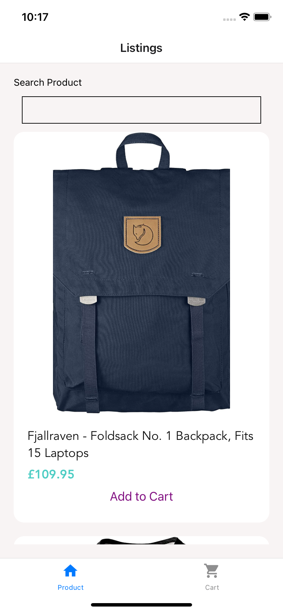

# DemoApp

Demo code for react native shopping cart



Install Expo Go in your phone, open following link<br>
https://expo.dev/@webtrackerxyz/ShoppingApp

Tested environment: <br>
Nodejs: v16.11.1 <br>
react: 18.2 <br>
react native: 0.71.8 <br>

// Functions

1. get JSON FROM hhttps://fakestoreapi.com/products
2. List the items by state
3. Search products -> filter the products by product name
4. Sort products by name, rating and price
5. Click an item -> show product Details
6. "ADD to CART" -> add to card
7. CART -> ADD / EDIT / REMOVE
8. React.redux for state storage (main branch)
   -> product
   -> cart
9. React.Context for state storage (context branch )
   -> product
   -> cart

// Navigation

TAB -> PRODUCT / CART <br>
PRODUCT -> LIST -> DETAILS <br>
CART -> LIST -> DETAILS <br>

#### Install and run

```
    1. install expo ( https://docs.expo.dev/ )
    2. npm install
    3. export EXPO_NO_TYPESCRIPT_SETUP=1
    4. expo start -c

    https://docs.expo.dev/guides/typescript/
    There is bug in expo for react 18. You can disable the TypeScript setup in Expo CLI with the environment variable EXPO_NO_TYPESCRIPT_SETUP=1
```

#### To run unit-testing

```
npm test
```

### App Structure

| File / dir     | Description                                                                                                                                 |
| -------------- | ------------------------------------------------------------------------------------------------------------------------------------------- |
| node_modules   | Contains all our lovely dependencies                                                                                                        |
| app/api        | Contains API endpoints                                                                                                                      |
| app/assets     | image, text or other resource files                                                                                                         |
| app/components | React Components such as Button, Card view, Icon, RatingUI, ScreenUI, sharing in different of App pages                                     |
| app/config     | Color and style config                                                                                                                      |
| app/hooks      | Custom hooks                                                                                                                                |
| app/navigation | App's navigation tree                                                                                                                       |
| app/screens    | App's main screens. Currently, there are List Products, Product details and Cart                                                            |
| app/store      | Store the redux types, actions and reducers                                                                                                 |
| app/types      | Store the type definition. Currently, there are Product and Cart types                                                                      |
| assets         | Icons and images files                                                                                                                      |
| App.tsx        | Main component of the React native application. It contains a router to handle navigation between different screens within the application. |
| jest.config.js | Jess configuration for unit testing                                                                                                         |
| README.md      | This file                                                                                                                                   |
| package.json   | Lists NPM dependencies and build scripts                                                                                                    |
| tsconfig.json  | Configures the TypeScript compiler                                                                                                          |
